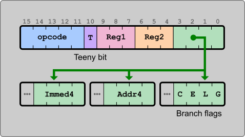

# TeenyAT Virtual Architecture 


The **TeenyAT** *(pronounced Teeny-@)* is a 16-bit virtual embedded microcontroller delivered as a C library (single header and single source) so systems can be simulated around it with ease. It's also good fun developing assembly programs to run on our premade systems! System designers create an instance (or more) of the TeenyAT, providing a binary image to load and execute, interacting with its TeenyAT instances through its peripheral bus and GPIO ports.

The **TeenyAT** project has a unique instruction set and a complete assembler. The *[tnasm](tnasm)* assembler and each included system can be compiled using `make` with their respective `Makefile`s. 

[Leroy](./docs/leroy.md) is glad you stopped by.

## Core Architectural Elements

### Memory
- **Word Size:** 16 bits
- **RAM:** 32K words, addresses `0x0000` - `0x7FFF`
- **On-Board Peripheral Space:** 1k words, addresses `0x8000` - `0x8FFF` including...
  - Two general purpose I/O (GPIO) ports, Ports A & B
  - Pseudo Random Number Generators that are streamable and unique to each TeenyAT instance
- **External Peripheral Space:** addresses, `0x9000` - `0xFFFF`
  - System designers use these when simulating their TeenyAT-accessible system hardware

### Registers

All TeenyAT registers are essentially general purpose, meaning any can be read from or written to by any instruction that uses registers.  So... divide your Program Counter by 3 or set the Zero register to 42 for whatever reason (although it will still contain zero afterward... we're not set-shaming).
- **PC (Program Counter):** Contains the address of the next instruction; initialized at `0x0000`
- **SP (Stack Pointer):** Tracks the address just below the top of the stack; initialized at `0x7FFF`. Stack grows downwards.
- **rZ (Zero Register):** Always contains `0`
- **General-purpose Registers:** rA, rB, rC, rD, rE

### Instruction Encoding
Instructions may be encoded in either one or two 16-bit words:
- **Teeny bit = 1:** Instruction is 16 bits 
- **Teeny bit = 0:** Instruction is 32 bits

## Instruction Encoding

### First Word

The bottom 4 bits of this word can be used as an immediate or address for teeny (1-word) instructions, so long as the value fits in 4 bits.  These bits are are used to distinguish each of the conditional jumps, and when appropriately set, can provide the unconditional jump.



### Second Word


See *[the instruction set documentation](docs/README.md)* for more information about how they are encoded.

## Systems Built Around TeenyAT

The **TeenyAT** architecture is a platform suitable for various embedded and educational applications. Writing systems is a key part in developing projects on the TeenyAT. Take a look at the provided **[Edison experiment board](edison)** and **[color lcd](lcd)** systems.

### Example System in C

The TeenyAT is designed to make system development as simple as possible so you can get your ideas from your mind to running quickly.  The code below is all it takes to build a system emulating a single LED on pin-0 of GPIO port A.

1. Load a binary file
2. Create a TeenyAT with that binary
3. Start giving that TeenyAT clock cycles and see what's on that port
4. Draw an '@' to show the LED is on and a '.' when it's off

```c
#include <stdio.h>
#include <stdlib.h>
#include "teenyat.h"

int main(int argc, char *argv[]) {
	FILE *bin_file = fopen("tbone.bin", "rb");
	teenyat t;
	tny_init_from_file(&t, bin_file, NULL, NULL);

	tny_word port_a;
	for ( int i=0; i <= 77; i++ ) {
		tny_clock(&t);
		tny_get_ports(&t,&port_a, NULL);
		
		if(port_a.bits.bit0 == 0) {
			printf("."); // LED Off
		}
		else {
			printf("@"); // LED On
		}
	}
	printf("\n");
	return EXIT_SUCCESS;
}
```

##### Save this as `led.c` and compile using `gcc -o led led.c teenyat.c` 

### Assembly

Here's a simple tnasm assembly program that "blinks" the LED.

```asm
.const PORT_A 0x8002

set rA, rZ

!main
    str [PORT_A], rA
    inv rA
    jmp !main
```
Save this as `tbone.asm` and assemble using `tnasm tbone.asm` 

This gives a `tbone.bin` file that can be run by your led system by executing `led tbone.bin`[^1]

[^1]: "T-Bone" was a nickname given by students to my undergraduate assembly language faculty.

### Results

Here in the output, you can trace how many cycles it takes for the assembly above to switch the LED's state.  It's like a simple custom osciliscope! 

```
........@@@@@@@.......@@@@@@@.......@@@@@@@.......@@@@@@@.......@@@@@@@.......
```
---
  
## License

This project is licensed under the MIT License. See the [LICENSE](LICENSE) file for details.
